# テスト管理ツール ER図（データモデル）

> 文書番号: ER-TM-2026-001 ／ バージョン: 1.0 ／ 作成日: 2026年5月11日

---

## 1. 全体 ER 図

> テーブル数が多いため、エリア別に4分割して表示しています。

### 1-A1. ユーザー・権限系

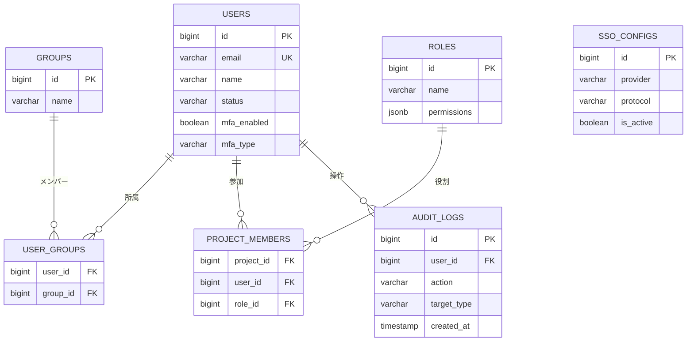

---

### 1-A2. プロジェクト・システム系

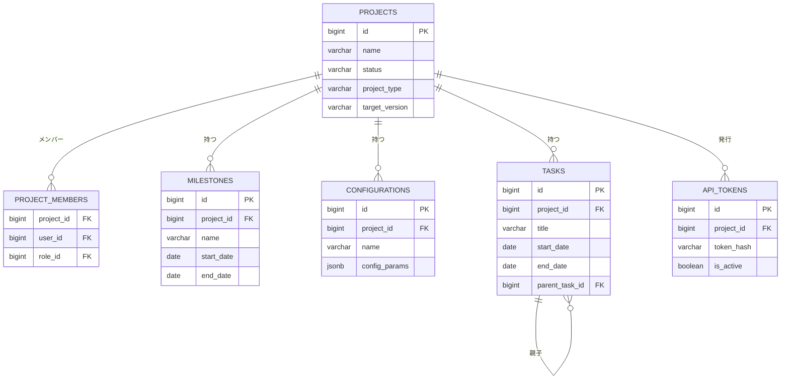

---

### 1-B. テスト設計系

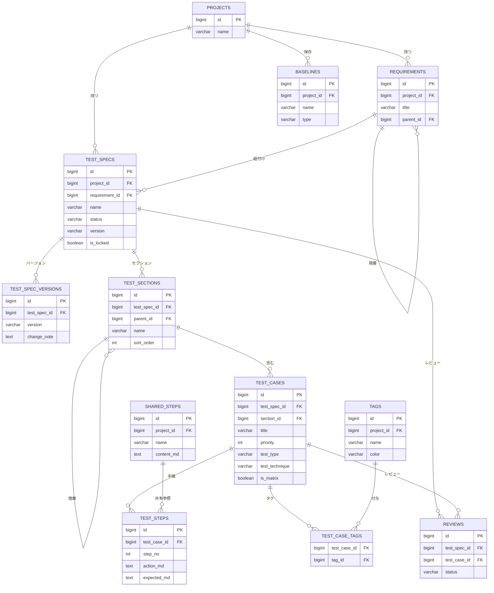

---

### 1-C. テスト実施・バグ系

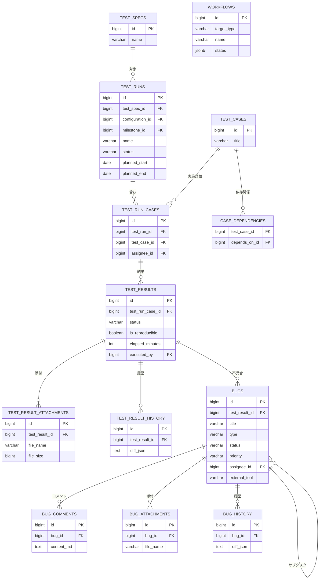

---

### 1-D. 資産・ダッシュボード系

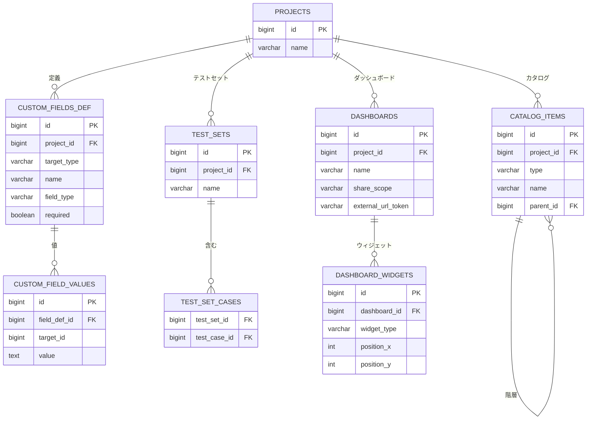

---

## 2. コアエンティティ関係（簡略版）

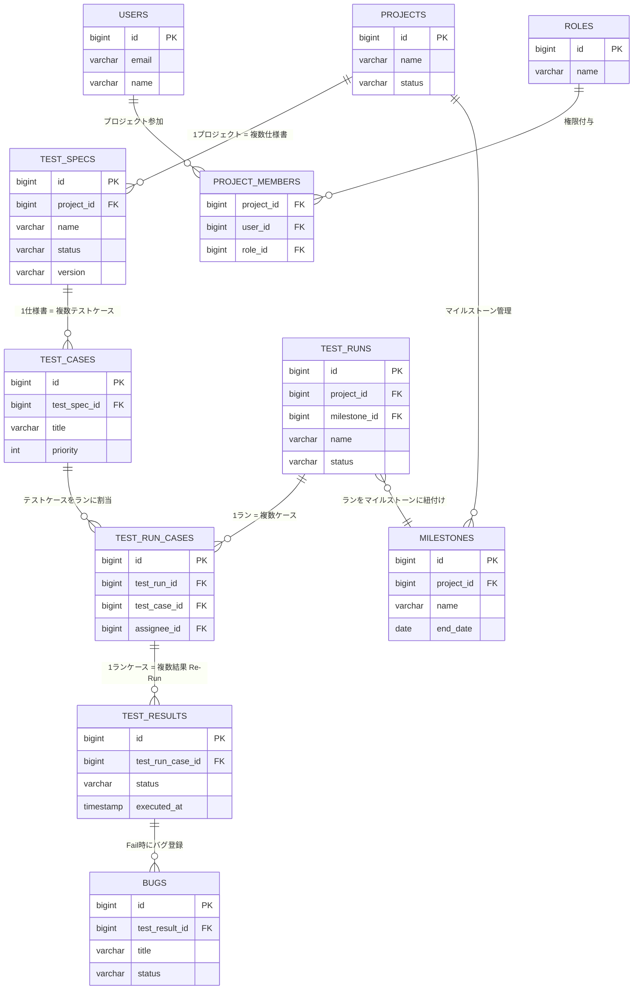

---

## 3. テストケース関連エンティティ詳細

### 3-A. テストケース・手順・タグ

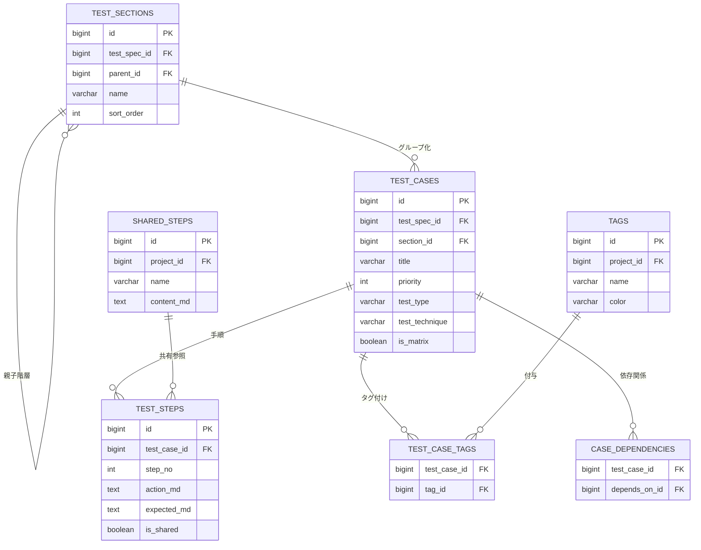

---

### 3-B. カスタムフィールド・履歴・資産

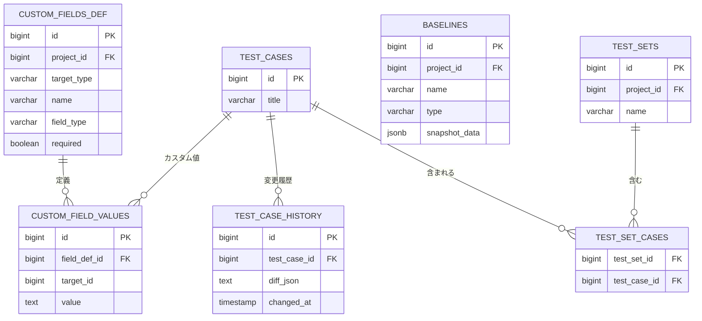

---

## 4. バグ・課題管理エンティティ詳細

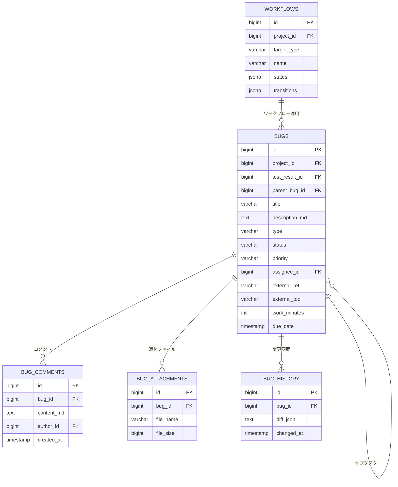

---

## 5. セキュリティ・認証エンティティ

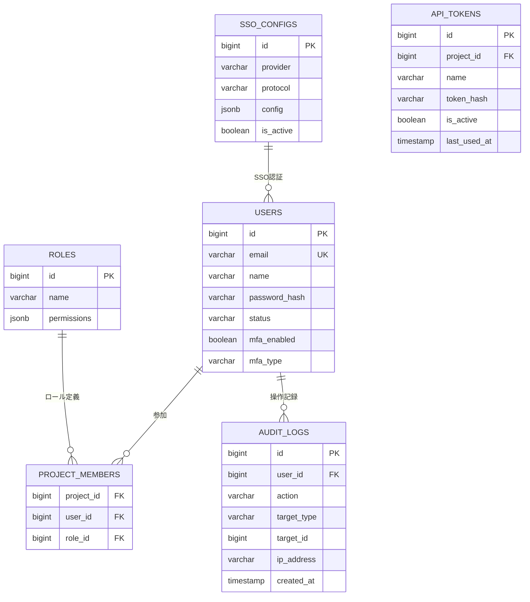

---

## 6. テーブル一覧サマリー

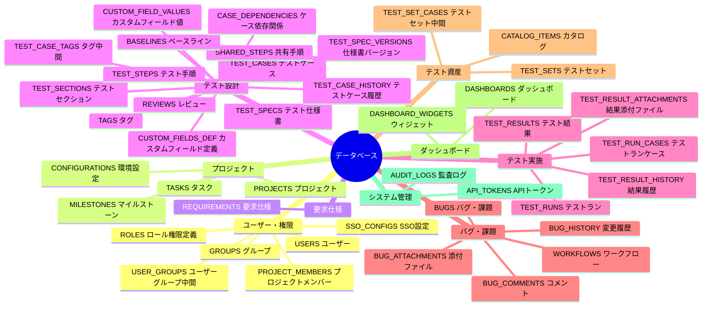

---

*本ER図はUSDM要求仕様書（SRS-TM-USDM-2026-001）に基づき設計しています。*
*実装時はRDBMS（PostgreSQL推奨）の制約・インデックス設計を別途定義してください。*
