# テスト管理ツール GUI仕様書

> 文書番号: GUI-TM-2026-001 ／ バージョン: 1.0 ／ 作成日: 2026年5月11日

---

## 1. 画面遷移図（全体）

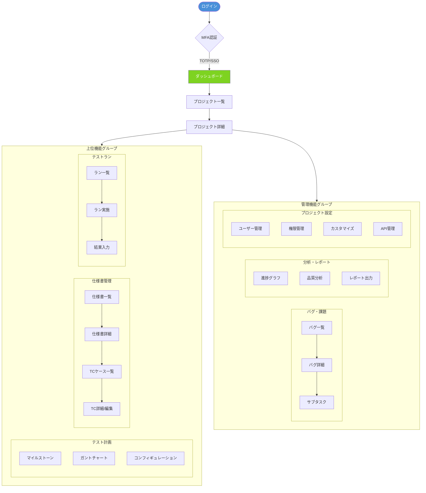

---

## 2. 画面レイアウト構成

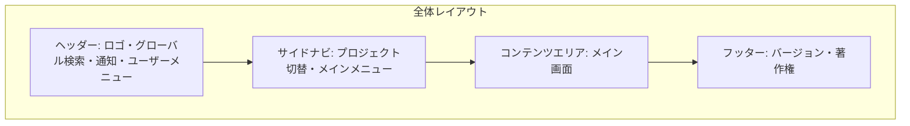

---

## 3. ダッシュボード画面（S-1301, S-1302）

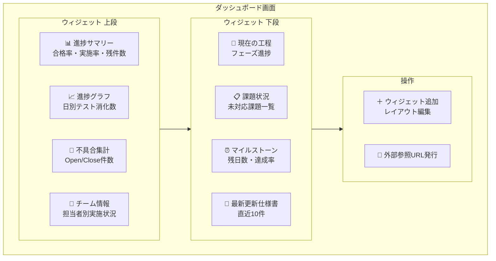

---

## 4. テストケース一覧・編集画面（S-0201〜S-0209, S-0301〜S-0309）

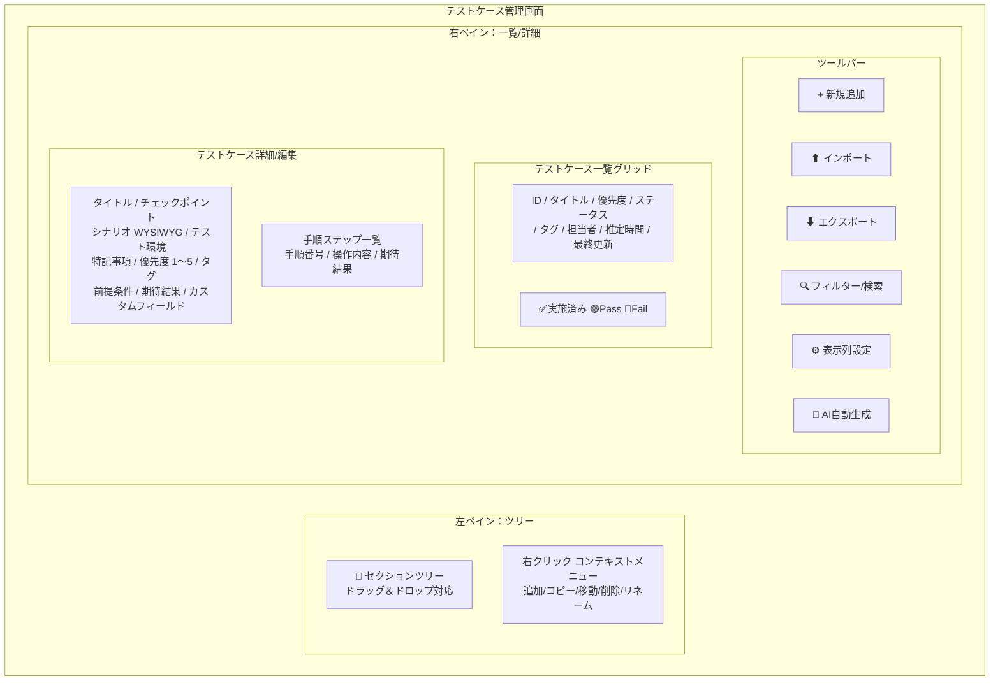

---

## 5. テストケース詳細フィールド仕様（S-0202, S-0208）

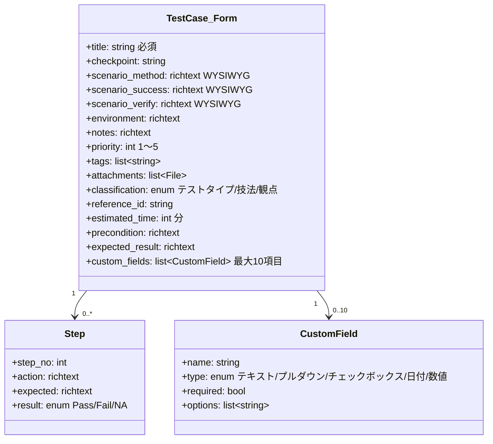

---

## 6. テストラン実施画面（S-0701〜S-0709）

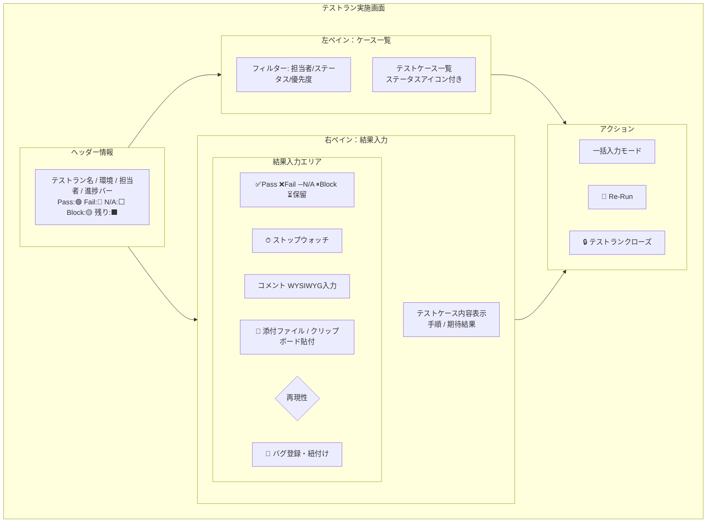

---

## 7. バグ・課題管理画面（S-1101〜S-1109）

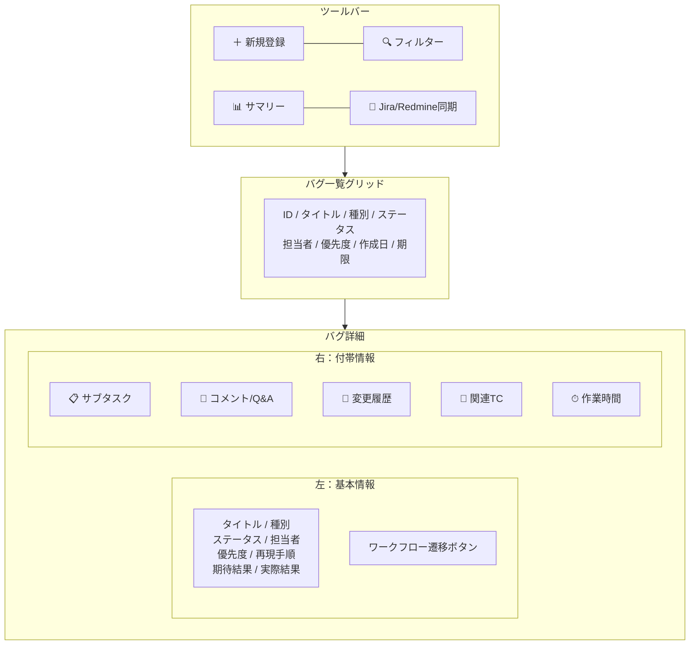

---

## 8. ガントチャート画面（S-0102, S-0108）

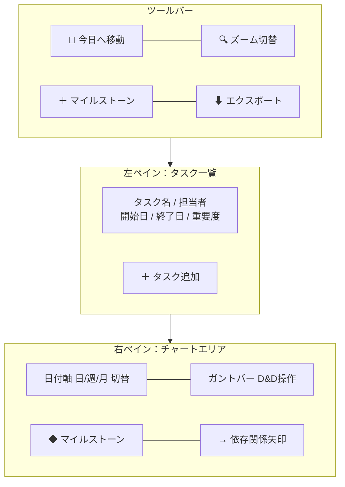

---

## 9. 分析・レポート画面（S-1401〜S-1411）

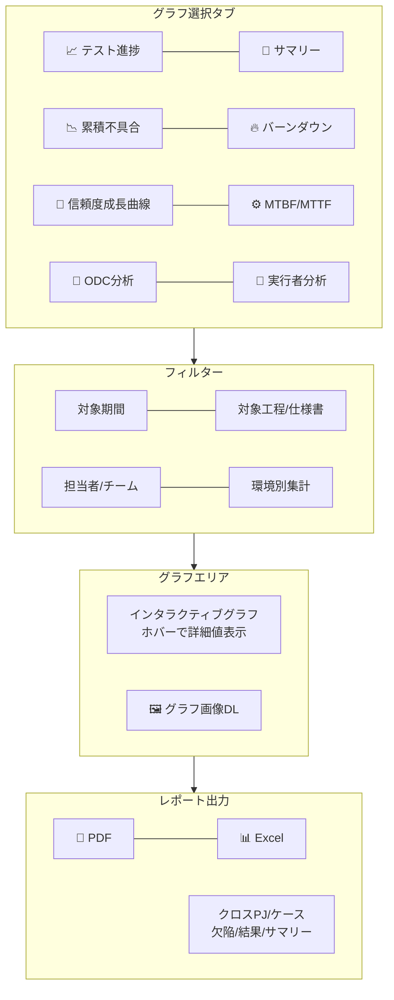

---

## 10. システム管理画面（S-2001〜S-2007, S-2201〜S-2205）

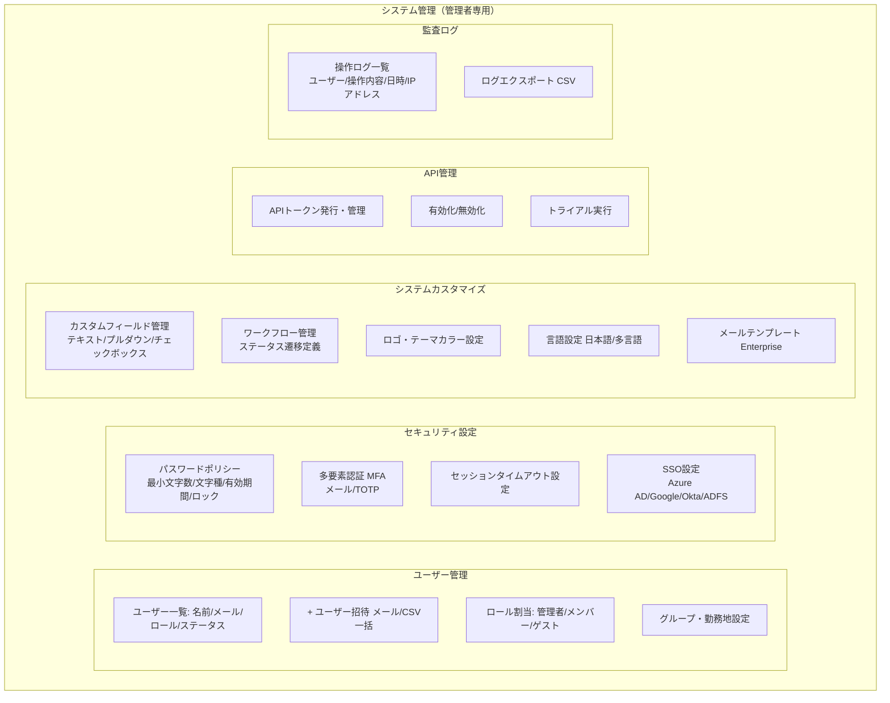

---

## 11. 画面別アクセス権限マトリクス

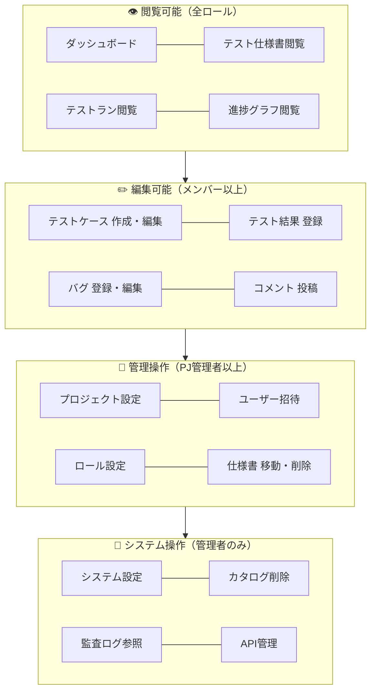

---

## 12. 入力コンポーネント仕様

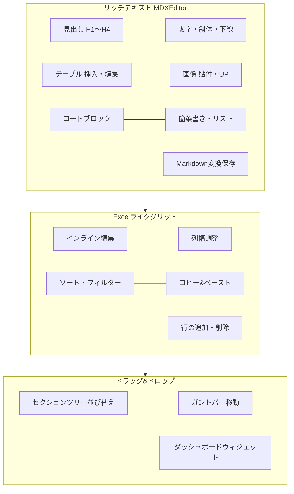

---

*本GUI仕様書はMermaid図形式で画面構成・遷移・機能を定義しています。*
*詳細なワイヤーフレームは別途UI設計書（Figma等）で管理します。*
